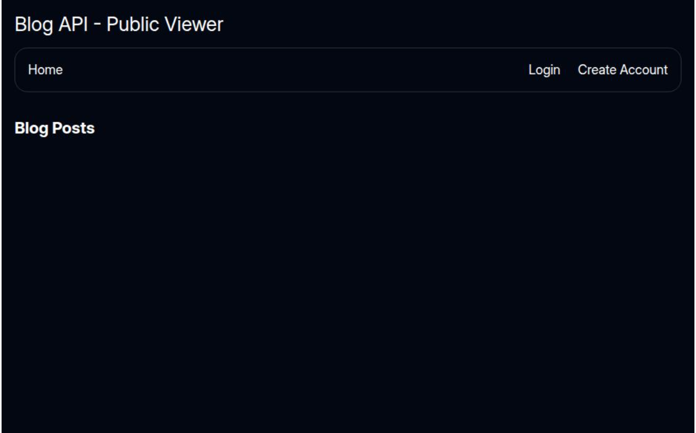
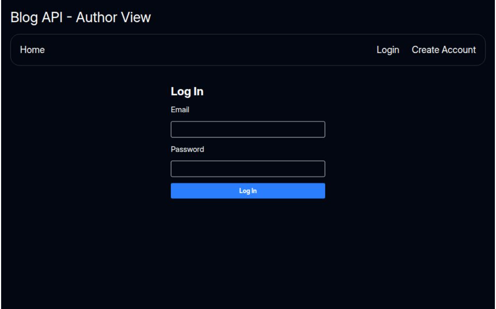

# Blog Platform (API + Public Reader + Author Admin)

A full-stack **headless Blog API** built with **Node.js, Express, PostgreSQL** and **Prisma**, powering two React frontends: a **public reader site** and an **author/admin site** for post management and comment moderation.

## Table of Contents

1. [Features](#features)
2. [Live Demo](#live-demo)
3. [Technologies Used](#technologies-used)
4. [Future Improvements](#future-improvements)
5. [Contributing](#contributing)
6. [License](#license)

---

## Features

### **Back End (apps/api)**

-   **RESTful CRUD** endpoints for **posts** and **comments**
-   **JWT Authentication** with **Passport.js** & **jsonwebtoken**
-   **Input validation** via **express-validator** and centralized error handling
-   **Prisma ORM** for schema modeling, migrations, and querying
-   Configured **CORS** to allow both frontends

### **Public Reader (apps/web)**

-   Browse **published posts** with summaries and full content
-   **User login/logout** via JWT (stored in localStorage)
-   **Comment management**: leave, edit & delete your own comments
-   Data loading & mutations with **React Router Framework v7** loaders/actions
-   Responsive UI styled with **Tailwind CSS**

### **Author Admin (apps/admin)**

-   View **all posts** (draft & published)
-   **Create & edit** posts using **TinyMCE** rich-text editor
-   **Publish/unpublish** via PATCH endpoint
-   **Moderate comments** (delete any)
-   Client-side fetching with **React hooks** & **React Router**

---

## Live Demo

-   **Public Reader:** https://blog-api-five-olive.vercel.app/
-   **Author Admin:** https://blog-api-14ej.vercel.app/
-   **API (Railway)**

  

---

## Technologies Used

### **Back End (apps/api)**

-   Node.js & Express.js
-   PostgreSQL & Prisma ORM
-   Passport.js & jsonwebtoken (JWT)
-   express-validator
-   CORS

### **Public Frontend (apps/web)**

-   Vite & React
-   React Router Framework v7
-   Tailwind CSS
-   React Hooks

### **Admin Frontend (apps/admin)**

-   Vite & React
-   React Router Framework v7
-   TinyMCE rich-text editor
-   Tailwind CSS

### **Deployment & Dev Tools**

-   Railway (API & database hosting)
-   Vercel (frontends)
-   dotenv for environment variables
-   Git & GitHub

---

## Future Improvements

-   **Search & Filtering** on reader site
-   **Email Notifications** on new comments
-   **Role-based Access** (admin, moderator, reader)
-   **Rate Limiting** to prevent spam

---

## Contributing

Contributions are welcome!

1. Fork this repository
2. Create your feature branch: `git checkout -b feature/your-feature`
3. Commit your changes: `git commit -m 'Add a cool feature'`
4. Push to the branch: `git push origin feature/your-feature`
5. Open a Pull Request

---

## License

This project is licensed under the [MIT License](/LICENSE).
